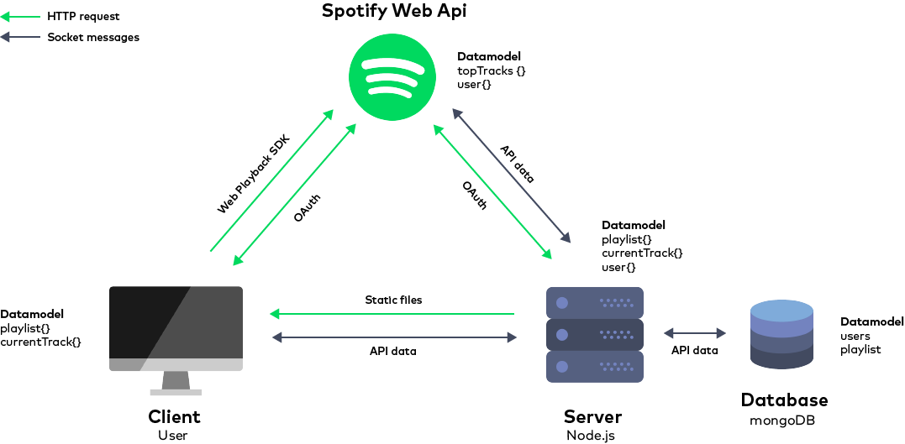

# real-time-web-project - Spotify together

With this application users can create a real time playlist which can play on every connected user. This way everyone can listen together to a playlist made by everyone! Users can add tracks to the playlist based on their favorite tracks/albums/artists.

[Link to application](https://spotify-together.herokuapp.com/)


## Background

In less than two weeks I've built a web application called Spotify Together. This app consumes an external data source through the Spotify Web API and serves a frontend using Node Express with EJS as templating language. The changes are reflected to a back-end data model with a database using mongoDB together with mongoose.

The data model gets updated by using real-time, event-based messaging with socket.io. The concept behind the application is that everyone can listen to the same music together. I've realised this by using the new spotify web playback SDK. This is a client-side JavaScript library which allows you to create a new player in Spotify Connect and play any audio track from Spotify in the browser via Encrypted Media Extensions.

So with this application users can create a real time playlist which plays real time on every connected user.

## Getting started

1.  Clone the repo `git clone`.
2.  Install dependencies `npm install`.
3.  Run `npm start` to start server on port 8888.

## Features
- See your own favorite tracks.
- Add tracks to a global playlist.
- Real time player on all connected devices.
- Get information about the currently playing track.
- Control the player globally.

## Setting up Node.js & Express

To get my project running I've started with `npm init` to initialize a `package.json`. From there I started to set-up a `Node.js` directory structure and starting to add different dependencies like `Express` for static file serving and templating.

## Data
This application uses the `Spotify Web Api` as external data source. With this API, my application can retrieve Spotify content such as album data and playlists. To access user-related data through the Web API, an application must be authorized by the user to access that particular information. When the user connect with my application his user data gets fetched to my server and saved in a database. Based on this particular user more data about his favorite tracks gets loaded and emitted to the client.

### Database system
This application uses mongoDB as database system with mongoose as schema-based model for application data. The database consist the users and a playlist.  When the user connect with my application the server checks if there already is an user present. If so send data from the database, else save that user in the database. Also the playlist is served from the database. When a user adds or removes a track in the playlist, the database gets updated.


### Data life cycle
This is the data model of the application. It shows the communication between the major components of the app.



## Authorization
To access user-related data through the Spotify Web API, my application must be authorized by the user to access particular user information. For authorization within my app I've used `passport.js`. This is an authentication middleware for Node.js with different Authentication mechanisms, known as strategies. I used the Passport strategy for authenticating with Spotify using the OAuth 2.0 API. Following this example [https://github.com/jmperez/passport-spotify#readme](https://github.com/jmperez/passport-spotify#readme)

## Socket.io
For this real time application I used `socket.io` to communicate between the server and clientside. This happens when a user adds or removes a track or starts playing with the player controls.

## Deployment

I've deployed my application by using `Heroku`. This was pretty easy to setup. Steps that I took:

1.  Signed in with an existing `Heroku` account.
2.  Added a new application.
3.  Chose `GitHub` as deployment method.
4.  Connected heroku to the `git repo` .
5.  App was running on [https://spotify-together.herokuapp.com/](https://spotify-together.herokuapp.com/)

Then I needed to change a few things to get the app working. First changed this line in my `app.js`

from:

```javascript
server.listen(8888, function() {
    console.log('server is running on port 8888');
});
```

to:
```javascript
server.listen(process.env.PORT || 8888, function() {
    console.log('server is running on port:8888');
});
```

This because Heroku assigns the port for you, so you can't set your own. You need to have read in the port number from the PORT environment variable. In this case it would be the `process.env.PORT` variable. [Source](https://stackoverflow.com/questions/43944929/how-to-listen-on-any-port-on-heroku-when-a-web-port-80-is-already-in-use)

Lastly I needed to add my environment variables to Heroku because they're not commited trough Github. This file contains the Spotify Api credentials and database login credentials. I added them mannualy in the heroku settings of the app. Then the server started running.

## Wishlist

- Real time sync the position of the current playing track for all clients.
- Users can search for tracks.
- User can see their own playlists.
- Added functionality where users can create and join rooms.
- Different rights of users where for example some can kick users and remove tracks, only if they have acces to it.
- Give the user a choice to select a device to play music on.
- Volume control where users with rights can mute other connected clients.
- See who's online.
- See who added a new track to the current playlist.

## Built With

- [Node.js](https://nodejs.org/en/) -  Server framework
- [Express](https://expressjs.com/) -  Static file serving/templating
- [EJS](http://ejs.co/) - Templating language
- [socket.io](https://socket.io/) -  Real-time engine
- [Spotify Web Api](https://developer.spotify.com/web-api/) -  Access Spotify Web Api data
- [Spotify Web Playback SDK](https://beta.developer.spotify.com/documentation/web-playback-sdk/quick-start/) - Play Spotify audio inside browser
- [Pasport.js](http://www.passportjs.org/) - Authentication middleware for Node.js

## License

MIT © Yoeri Pasmans
